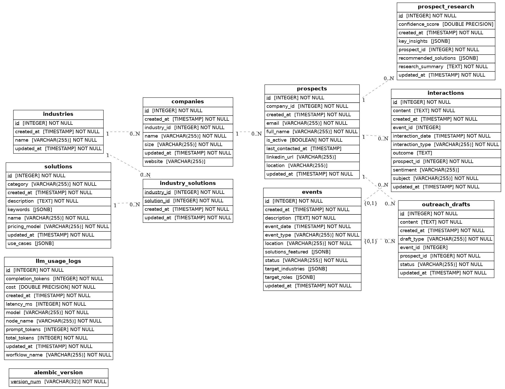

# Database Schema Documentation

## Overview

Sales assistant database containing prospect management, event tracking, solutions catalog, and LLM usage analytics.

---

## Tables

### alembic_version

Migration version tracking table.

| Column | Type | Constraints |
|--------|------|-------------|
| version_num | VARCHAR(32) | PRIMARY KEY, NOT NULL |

---

### industries

Industry classifications for companies and solutions.

| Column | Type | Constraints |
|--------|------|-------------|
| id | SERIAL | PRIMARY KEY |
| name | VARCHAR(255) | NOT NULL |
| created_at | TIMESTAMP | NOT NULL |
| updated_at | TIMESTAMP | NOT NULL |

---

### companies

Company information linked to industries.

| Column | Type | Constraints |
|--------|------|-------------|
| id | SERIAL | PRIMARY KEY |
| name | VARCHAR(255) | NOT NULL |
| industry_id | INTEGER | NOT NULL, FK → industries.id |
| size | VARCHAR(255) | NOT NULL |
| website | VARCHAR(255) | NULL |
| created_at | TIMESTAMP | NOT NULL |
| updated_at | TIMESTAMP | NOT NULL |

---

### prospects

Sales prospects with contact information and engagement status.

| Column | Type | Constraints |
|--------|------|-------------|
| id | SERIAL | PRIMARY KEY |
| full_name | VARCHAR(255) | NOT NULL |
| email | VARCHAR(255) | NOT NULL |
| linkedin_url | VARCHAR(255) | NULL |
| location | VARCHAR(255) | NULL |
| company_id | INTEGER | NOT NULL, FK → companies.id |
| last_contacted_at | TIMESTAMP | NULL |
| is_active | BOOLEAN | NOT NULL |
| status | prospect_status | NOT NULL |
| created_at | TIMESTAMP | NOT NULL |
| updated_at | TIMESTAMP | NOT NULL |

---

### solutions

Product/service solutions with pricing and categorization.

| Column | Type | Constraints |
|--------|------|-------------|
| id | SERIAL | PRIMARY KEY |
| name | VARCHAR(255) | NOT NULL |
| category | VARCHAR(255) | NOT NULL |
| description | TEXT | NOT NULL |
| use_cases | JSONB | NULL |
| keywords | JSONB | NULL |
| pricing_model | pricing_models | NOT NULL |
| created_at | TIMESTAMP | NOT NULL |
| updated_at | TIMESTAMP | NOT NULL |

---

### industry_solutions

Junction table linking industries to relevant solutions.

| Column | Type | Constraints |
|--------|------|-------------|
| industry_id | INTEGER | NOT NULL, FK → industries.id, PRIMARY KEY |
| solution_id | INTEGER | NOT NULL, FK → solutions.id, PRIMARY KEY |
| created_at | TIMESTAMP | NOT NULL |
| updated_at | TIMESTAMP | NOT NULL |

---

### events

Sales events and conferences with targeting information.

| Column | Type | Constraints |
|--------|------|-------------|
| id | SERIAL | PRIMARY KEY |
| event_type | VARCHAR(255) | NOT NULL |
| event_date | TIMESTAMP | NOT NULL |
| description | TEXT | NOT NULL |
| location | VARCHAR(255) | NOT NULL |
| target_industries | JSONB | NULL |
| target_roles | JSONB | NULL |
| solutions_featured | JSONB | NULL |
| status | VARCHAR(255) | NOT NULL |
| created_at | TIMESTAMP | NOT NULL |
| updated_at | TIMESTAMP | NOT NULL |

---

### interactions

Prospect interaction history (emails, calls, meetings, etc.).

| Column | Type | Constraints |
|--------|------|-------------|
| id | SERIAL | PRIMARY KEY |
| prospect_id | INTEGER | NOT NULL, FK → prospects.id |
| event_id | INTEGER | NULL, FK → events.id |
| interaction_type | interaction_types | NOT NULL |
| interaction_date | TIMESTAMP | NOT NULL |
| subject | VARCHAR(255) | NOT NULL |
| content | TEXT | NOT NULL |
| sentiment | VARCHAR(255) | NULL |
| outcome | TEXT | NULL |
| created_at | TIMESTAMP | NOT NULL |
| updated_at | TIMESTAMP | NOT NULL |

---

### outreach_drafts

Generated outreach communication drafts.

| Column | Type | Constraints |
|--------|------|-------------|
| id | SERIAL | PRIMARY KEY |
| prospect_id | INTEGER | NOT NULL, FK → prospects.id |
| event_id | INTEGER | NULL, FK → events.id |
| draft_type | VARCHAR(255) | NOT NULL |
| content | TEXT | NOT NULL |
| status | VARCHAR(255) | NOT NULL |
| created_at | TIMESTAMP | NOT NULL |
| updated_at | TIMESTAMP | NOT NULL |

---

### prospect_research

Research findings and recommendations for prospects.

| Column | Type | Constraints |
|--------|------|-------------|
| id | SERIAL | PRIMARY KEY |
| prospect_id | INTEGER | NOT NULL, FK → prospects.id |
| research_summary | TEXT | NOT NULL |
| key_insights | JSONB | NULL |
| recommended_solutions | JSONB | NULL |
| confidence_score | DOUBLE PRECISION | NULL |
| created_at | TIMESTAMP | NOT NULL |
| updated_at | TIMESTAMP | NOT NULL |

---

### llm_usage_logs

LLM API usage tracking for cost and performance analytics.

| Column | Type | Constraints |
|--------|------|-------------|
| id | SERIAL | PRIMARY KEY |
| worfklow_name | VARCHAR(255) | NOT NULL |
| node_name | VARCHAR(255) | NOT NULL |
| model | VARCHAR(255) | NOT NULL |
| prompt_tokens | INTEGER | NOT NULL |
| completion_tokens | INTEGER | NOT NULL |
| total_tokens | INTEGER | NOT NULL |
| latency_ms | INTEGER | NOT NULL |
| cost | DOUBLE PRECISION | NOT NULL |
| created_at | TIMESTAMP | NOT NULL |
| updated_at | TIMESTAMP | NOT NULL |

---

## Custom Types

- **pricing_models**: Enum for solution pricing models
- **prospect_status**: Enum for prospect engagement status
- **interaction_types**: Enum for interaction/communication types

---

## Key Relationships

```
industries (1) ──────── (many) companies
                               │
                               └─── (many) prospects
                                           │
                    ┌──────────────────────┼──────────────┐
                    │                      │              │
              interactions          outreach_drafts  prospect_research
              (FK: event_id)        (FK: event_id)
                    │
                 events

solutions ──────────── industry_solutions ──────────── industries

llm_usage_logs (standalone analytics table)
```

## ER Diagram


